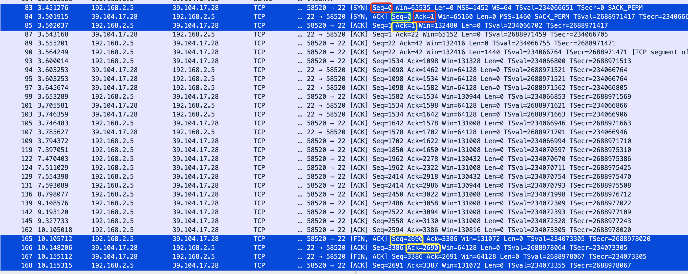
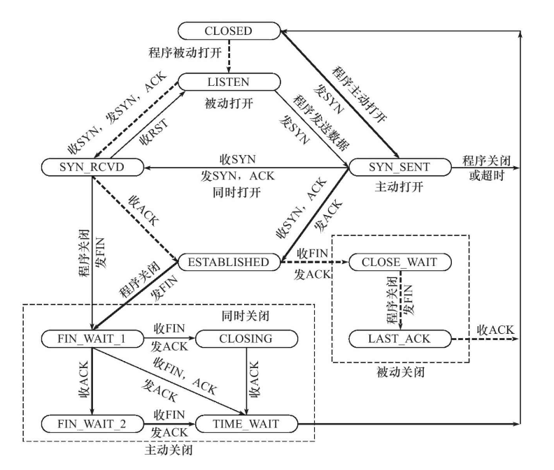
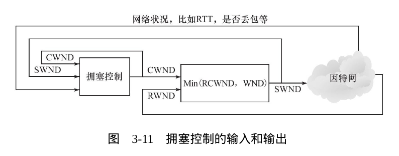
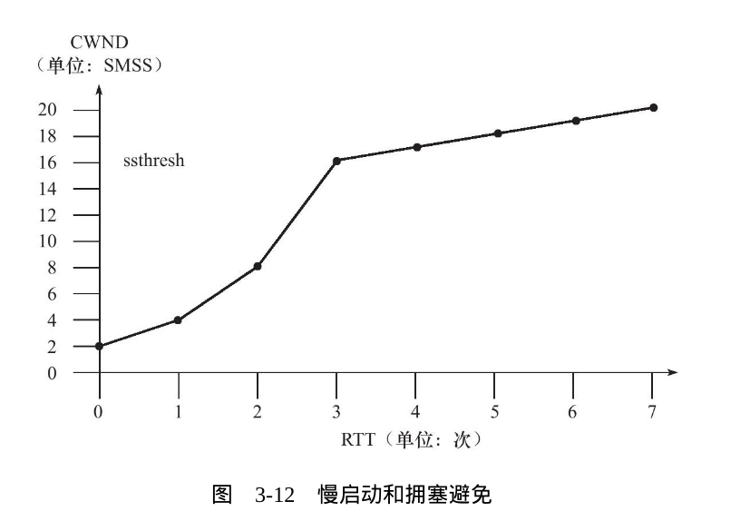

## TCP的特点
- 基于字节流
- 面向连接
- 可靠传输

这种连接必须是 1 对 1,因此广播和多播的应用程序不能使用 TCP 服务

TCP是可靠的.TCP 采用应答机制,发送的每一个 TCP 报文必须得到接收方的应答,才认为这个 TCP 报文段传输成功,不然就要重新传送.

## 一个错误
我抓了个包看了下,3次 TCP 握手没问题,但是四次挥手是不完全通用的.

我问了下 chat GPT,他的回答如下:
您是对的，我之前的回答并不完全准确，因为在TCP四次挥手的ACK序号方面，有两种情况：

ACK的序号是对方的序列号：在某些情况下，ACK的序号是对方的序列号，而不是对方的序列号加1。这通常发生在接收到数据后，需要确认接收到的数据。

ACK的序号是对方的序列号加1：在其他情况下，ACK的序号是对方的序列号加1。这通常发生在发送端主动关闭连接时，发送FIN并等待对方的ACK确认。

具体是哪种情况取决于连接的状态和数据的传输情况。因此，在TCP四次挥手过程中，ACK的序号可以是对方的序列号，也可以是对方的序列号加1，具体取决于每一步的操作和状态。

感谢您的纠正，希望这一点能够更好地解释ACK序号的不同情况。
## TCP连接状态转移图

这个图非常好,我把它画出来挂在桌子前方时常观察.

### 问题:如果客户端发了 FIN 之后,也没接收到 ACK(或者接收到了),那么长时间处于 FIN_WAIT_1或者FIN_WAIT_2 状态,将会发生什么?

答案是:此时的客户端连接由内核来接管,就像那个被 init 程序接管的孤儿进程,这种连接被称为孤儿连接.孤儿连接有生存时间,时间一到,就自动发一个 ACK,服务器也会从 LAST_ACK结束连接.

### 问题:为什么要在 TIME_WAIT 阶段等待一会儿

因为万一 ACK 没有发出去,服务器就会重复发送 FIN,而这时,客户端结束了,无法继续重传 ACK,那服务器就会认为这是一个错误.

如果在 TIME_WAIT 阶段等会儿,如果没有再收到 FIN,那么客户端就会认为服务端已经收到了 ACK,这样就会安全关闭.

这个状态一般会维持 2MSL,也就是 4 分钟.这是 TCP 报文最大生存时间.

在 linux 上,一个TCP 端口不能被打开多次,如果关闭后,另一个程序立即使用它,那么就会导致客户端和服务器不匹配的错误.

最后一个原因,由于 TCP 报文段的MSL 为 2 分钟.假设 失去动静1分59 秒后服务器收到了一个 ACK,然后又发送了一个 ACK;又过了 1 分 59 秒,客户端收到了来自服务端的 ACK.这样,比较极限的情况下,接近 4 分钟客户端再一次收到了来自服务器的消息,说明还没有彻底断开.
反之,如果 4 分钟之内都没有任何动静,那么整个链路上都没有和原来连接有关的数据包了.这样就可以建立新的连接了!

有时候,我们希望立即重启一个程序,但是由于2MSL,不得不等 4 分钟.有什么好的办法?

对于客户端,这个无所谓,我们的客户端使用系统自动分配的端口来进行建立连接,重启都可以启动成功.

对于服务器主动关闭后,我们可以利用 SOCKET中的某些字段,比如 SO_REUSEADDR把手伸进 TCP 内核处,强制进程立即使用 TIME_WAIT状态的连接占用的端口,来解决这个问题.这个将在第 5 章讨论.

## 复位报文段

在某些情况下,TCP 的一端会向另一端发送携带 RST 标志的报文段,就是复位报文段,以通知对方关闭连接或重新建立连接.

### 访问不存在的端口
R 标志

### 异常终止连接

### 处理半打开连接
服务器关闭或者异常终止了连接,而客户端没有收到结束报文段.

客户端继续发送数据,服务器就会回应一个复位报文.

## TCP 交互数据流

- 交互数据
- 成块数据

## 带外数据

OOB, out of band data.
TCP 中没有真正的外带数据,但是可以利用 TCP 中的紧急指针标志以及紧急指针,来传送紧急数据.因此一般也将 TCP 紧急数据称为带外数据.

## TCP 超时重传
关于 TCP 如何保证可靠传输

TCP 为每一个 TCP 报文段都维护一个重传定时器,该定时器在 TCP 报文段第一次被发送时启动.

虽然超时会导致 TCP 报文段重传,但是 TCP 报文段的重传可以发生在超时执之前------快速重传

## 拥塞控制

TCP 模块另一个重要任务:提高网络利用率,降低丢包率,保证网络思源对每条数据流的公平性-----拥塞控制

拥塞控制四个部分:
- 慢启动
- 拥塞避免
- 快速重传
- 快速恢复

拥塞控制的最终变量是发送端向网络一次连续写入的数据量,但由于最终还是以 TCP 发送数据,因此数据发送量就成了 SMSS 的数量(SMSS:Sender Maximum Segment Size).

所以发送端要合理设置 SWND.SWND=min(RWND,CWND),这由接收方通过控制 RWND 来设置 SWND.

### 慢启动和拥塞避免

TCP 连接建立好后:
- CWND 被设置为 IW(initial window),大小为 2~4个 SMSS.(新的 linux 内核提高了这个值)
- 然后发送端每收到一个接收端的确认,其 CWND 就按照:CWND+=min(N,SMSS)
- 这样CWND就能指数增长,因为发送的越多,未确认的就越多.这就是所谓的慢启动,慢启动算法的理由是,TCP 并不知道网络撞状况如何,只能去试探.
- 当 CWND 增大得很大时,网络就会拥塞.
- 因此 TCP 拥塞控制中定义了另一个重要的状态变量:慢启动门限.
- 当 CWND 的大小超过该值的时候,TCP 拥塞控制将进入拥塞避免阶段.
- 避免算法使得 CWND 接着以线性方式增长,按照 RTT,不按照确认数

  

### 怎么判断拥塞是否发生
- 传输超时,TCP 重传定时器溢出
- 接收到重复的确认数据报

### 快速重传和快速恢复

收到重复的 ACK 是正常的,可以理解督促发送端赶紧发数据:
- 重传请求：当发送端发送数据包，但接收端未能及时收到或确认它们时，发送端可能会不断重传相同的数据包，直到收到确认。这可能导致接收端不断发送相同的确认报文，以响应每个数据包的重传请求。

- 网络延迟或乱序：有时，网络中的数据包可能会出现延迟或乱序。接收端可能已经收到某个数据包，但由于延迟或乱序，它需要发送相同的确认以告知发送端已接收到数据包。

- 提高可靠性：TCP协议非常注重数据的可靠性传输。发送端会等待接收到一定数量的确认报文，以确保数据包已成功传输，然后才将它们标记为已传输。因此，连续发送相同的确认报文有助于提高数据的可靠性，以防止数据丢失或损坏。

- 快速重传：当接收端检测到丢失的数据包时，它可以立即发送确认报文来请求发送端快速重传丢失的数据包。这种情况下，确认报文可能是相同的，以请求特定数据包的重传。

- 流量控制：接收端的流量控制窗口可能变化，以调整数据包的传输速率。在这种情况下，确认报文可能是相同的，以通知发送端继续发送数据。

因此发送端如果连续接受三个重读的确认报文段,就认为拥塞发生了.

