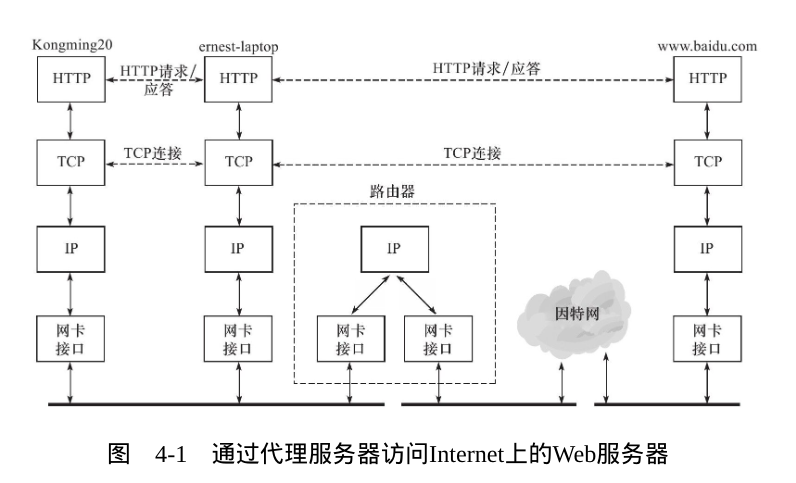
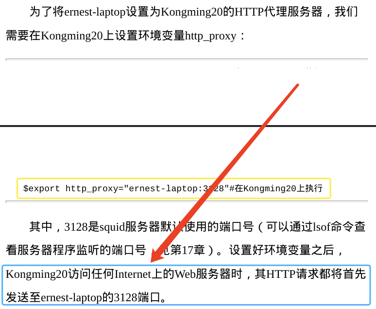
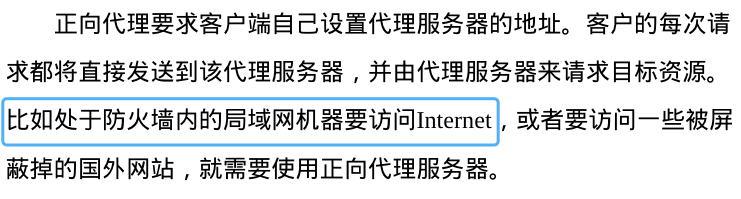
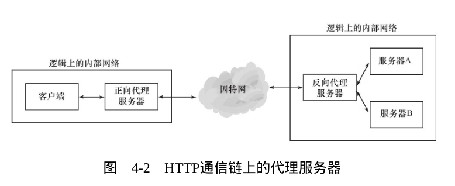

三个机器都是通过 http 协议通信的,中间体扮演服务器和客户端的角色.

## 部署代理服务器
### HTTP 代理服务器的工作原理
代理服务器按照使用方式和作用,分为正向代理服务器,反向代理服务器,和透明代理服务器.

- 正向服务器: 客户端设置代理服务器的地址
- 反向服务器:客户端不需进行任何设置,反向代理服务器就像一个真实的服务器.它接收到网络请求之后,会将请求转发给内网其它服务器,并将从内部服务器上得到结果返回给客户端.
  反向代理使用场景
负载均衡
服务器集群中有负荷较高者，减少服务器压力提升服务器安全性
作为防火墙
隐藏真是服务器ip dos攻击防扩加密/SSL加速缓存服务，加速客户端访问数据
统一压缩 节约宽带
统一的访问权限控制
统一的访问控制突破互联网封锁
等等

- 透明代理只能设置在网关上,对用户来说是透明的.透明代理是正向代理服务器的一种特殊情况.

总结
最核心的不同在于代理的对象不同

正向代理是代理客户端，反向代理是代理服务器

而根据这核心的区别，我们也可以记住:代理哪端便可以隐藏哪端

正向代理隐藏真实客户端，反向代理隐藏真实服务端

### HTTP 请求
短连接:每一个 tcp 连接 只能服务一个 http 请求(Connection:close)

长连接:很多 http 请求能走同一个 tcp 连接(Connection:keep-alive)

### HTTP 应答

